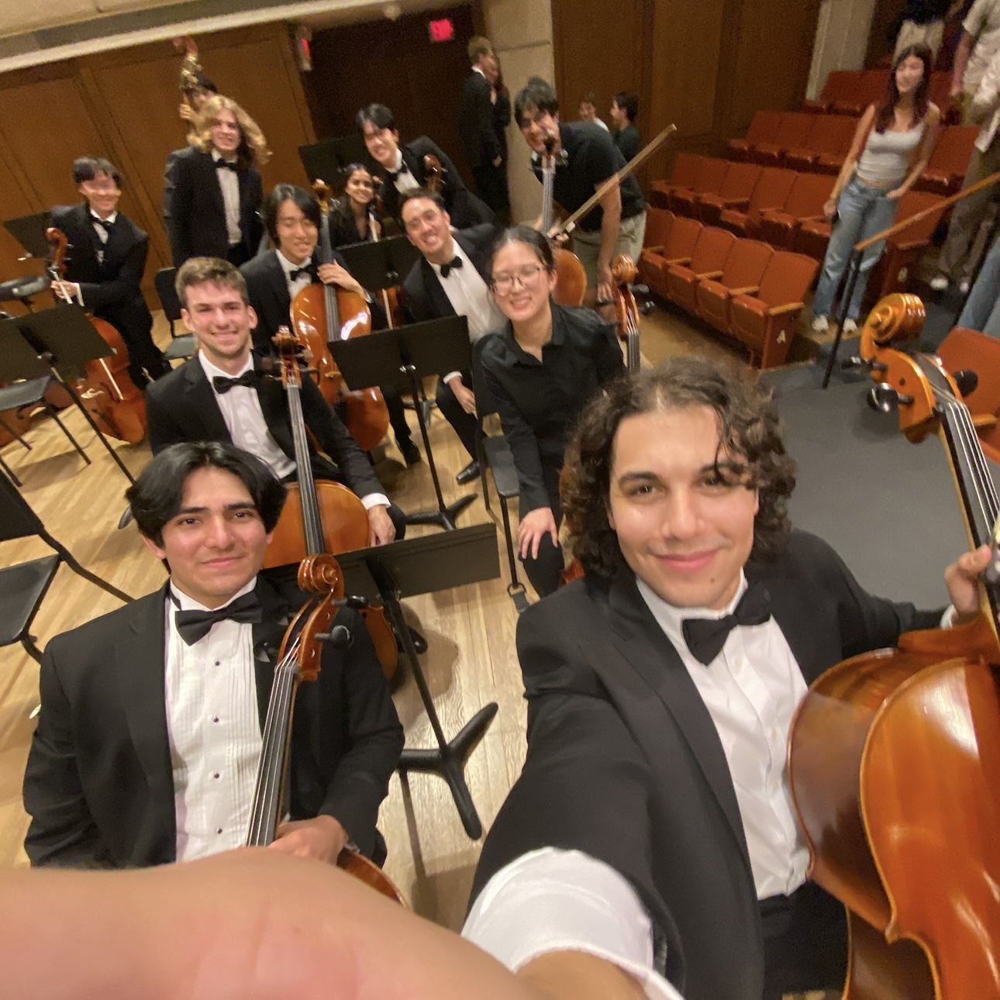
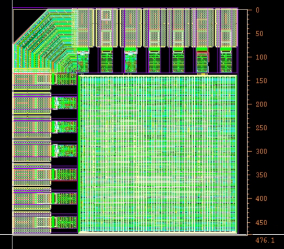
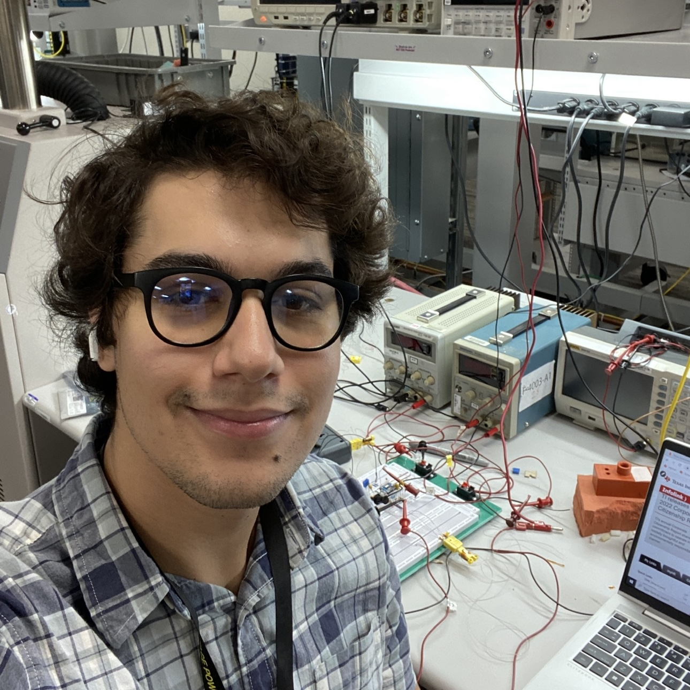

👨🏻‍💻 I’m a final year M.S. ECE student at [The University of Texas at Austin](https://www.utexas.edu/). I will be starting at [IBM](https://www.ibm.com/us-en) this Fall as a Logic Designer for the High-Speed Interconnect Team in Austin, TX!

🔬 In undergrad, I double majored in [ECE](https://www.ece.utexas.edu/) and [Mathematics](https://math.utexas.edu/) with a minor in [Computational Engineering](https://oden.utexas.edu/).

📚 I’m currently working as an the head TA for **Digital Logic Design** a part of the **Tokyo Tech** program. I was previously the head TA for [Intro to Embedded Systems](https://users.ece.utexas.edu/~valvano/mspm0/).

🎻 I also played cello for the [UT University Orchestra](https://music.utexas.edu/ensembles/university-orchestra) and am learning Arabic, Spanish, and Japanese.

What I do
======
I am passionate about advancing the frontiers of computer architecture, with a deep interest in hardware/software co-design and the development of hardware accelerators. My approach is grounded in mathematical rigor and driven by a fascination with high-performance computing. I enjoy dissecting complex systems to identify performance bottlenecks and architecting optimized hardware solutions that align tightly with algorithmic structures. My goal is to contribute to the design of next-generation computing platforms that are not only computationally powerful but also efficient and scalable, enabling transformative capabilities in scientific computing, machine learning, and beyond.

Current Projects
------

**Structural Verilog x86 CPU Implementation** 
My friends and I designed a custom x86 implementation from architectural specification to functional verifiation using only structural gate primatives in three months. Our processor features a 6-stage pipeline with a Banked I-Cache, Next-line Prefetcher, G-Share Branch Predictor, Non-blocking Writeback D-Cache, Non-Stalling Writeback Stage, Double-Clocked Address and Data Bus, and an advanced D-Cache replacement policy. Moreover, we interface I/O devices such as a Keyboard and DMA, and support interrupt and exception handling. This was for our [Microarchitecture](https://users.ece.utexas.edu/~patt/26s.382N/) class with Dr. Yale Patt.

**Taped-out Google TPU ASIC** 
Inspired by [Google TPUv1](../files/TPU%20ISCA%202017.pdf), I designed my own Tensor Processing Unit on a 476µm by 476µm ASIC using TSMC 65nm technology nodes and Cadence/Synopsys flows. I architected the TPU from scratch, creating my own 5-instruction CISC ISA, built an assembler in Python, and microarchitected all blocks of the RTL, including an NxN weight-stationary systolic array to perform matrix multiplication in SystemVerilog. I went through the entire ASIC design flow, including functional verification, synthesis, floor planning, power planning, P&R, pad placement, signoff, and post-silicon validation. Currently I am interfacing the chip with a ZedBoard for a full-stack software-to-silicon demo.

Selected Experience
------

**FPGA Engineer Intern**, _Applied Research Laboratories_ 
Designed RTL in VHDL for accelerating signal processing and digital communication applications.

**SoC Design Verification Engineer Intern**, _Apple_ 
Developed a complete UVM testbench for a distributed MMU IP in SystemVerilog.

**Validation Engineer Intern**, _Texas Instruments_ 
Designed and simulated an analog circuit that isolates high voltage from a temperature forcing unit.

**Embedded Software Engineer Intern**, _Applied Research Laboratories_ 
Programmed firmware in C++ for a high-frequency radio-link simulator to interface with analog and digital attenuators.
