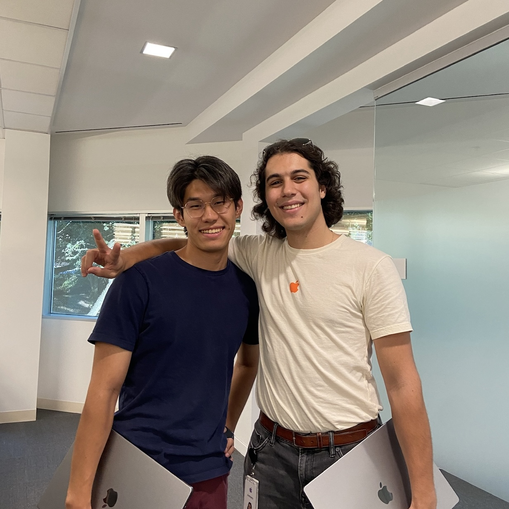

👨🏻‍💻 I’m a final year M.S. ECE student at [The University of Texas at Austin](https://www.utexas.edu/).

🔬 In undergrad, I double majored in [ECE](https://www.ece.utexas.edu/) and [Mathematics](https://math.utexas.edu/) with a Minor in [Computational Engineering](https://oden.utexas.edu/).

📚 I’m currently working as the head TA for [Intro to Embedded Systems](https://users.ece.utexas.edu/~valvano/mspm0/).

🎻 I also play cello for the [UT University Orchestra](https://music.utexas.edu/ensembles/university-orchestra) and am learning Arabic and Spanish.

What I do
======
I am passionate about advancing the frontiers of computer architecture, with a deep interest in hardware/software co-design and the development of hardware accelerators. My approach is grounded in mathematical rigor and driven by a fascination with high-performance computing. I enjoy dissecting complex systems to identify performance bottlenecks and architecting optimized hardware solutions that align tightly with algorithmic structures. My goal is to contribute to the design of next-generation computing platforms that are not only computationally powerful but also efficient and scalable, enabling transformative capabilities in scientific computing, machine learning, and beyond.

Current Projects
------

**Open Accelerators** 
To practice my RTL design and to master HPC algorithms ranging from linear algebra to partial differential equations, I am working on an open-source platform for engineers to share their accelerator designs for the scientific computing community to easily interface their applications with.

**Google TPU ASIC** 
Inspired by [Google TPUv1](../files/TPU%20ISCA%202017.pdf), I designed my own Tensor Processing Unit on a 476µm by 476µm ASIC using TSMC 65nm technology nodes and Cadence/Synopsys flows. I architected the TPU from scratch, creating my own 5-instruction CISC ISA, built an Assembly in Python, and microarchitected all blocks of the RTL, including an NxN weight-stationary systolic array to perform matrix multiplication in SystemVerilog. I went through the entire ASIC design flow, including Functional Verification, Synthesis, Floor Planning, Power Planning, P&R, Pad Placement, and Signoff. The chip is getting manufactured, to which I will perform post-silicon validation of the chip.

Selected Experience
------

**FPGA Engineer Intern**, _Applied Research Laboratories_ 
Designing RTL in VHDL for accelerating signal processing and digital communication applications.

**SoC Design Verification Engineer Intern**, _Apple_ 
Developed a complete UVM testbench for a distributed MMU IP in SystemVerilog.

**Functional Validation Engineer Intern**, _Texas Instruments_ 
Designed and simulated an analog circuit that isolates high voltage from a temperature forcing unit.

**Embedded Software Engineer Intern**, _Applied Research Laboratories_ 
Programmed firmware in C++ for a high-frequency radio-link simulator to interface with analog and digital attenuators.
